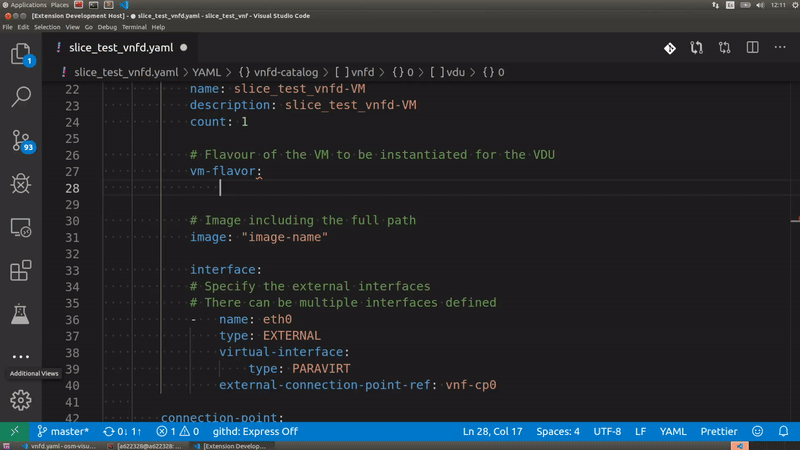

# Opensource mano visualstudio extension

## Features

After you install this extension you will be able to get linting of vnf, ns and nst descriptors for OSM. Also the extension is able to provide descriptions of fields and autocompletion.

The extension is activated when the filename follows the pattern `[*vnfd.yaml*,nsd.yaml*,*nst.yaml*]`

### Autocompletion Feature

### Linting Feature

## Requirements

This extension use the redhat-yaml vs code plugin and it is installed as extension pack.

## Known Issues

No known issues

## Release Notes

OSM visualstudio code extension for linting and Autocompletion of Descriptors

### 1.0.0

Initial release of OSM visualstudio code extension for Linting and Autocompletion of Descriptors.
